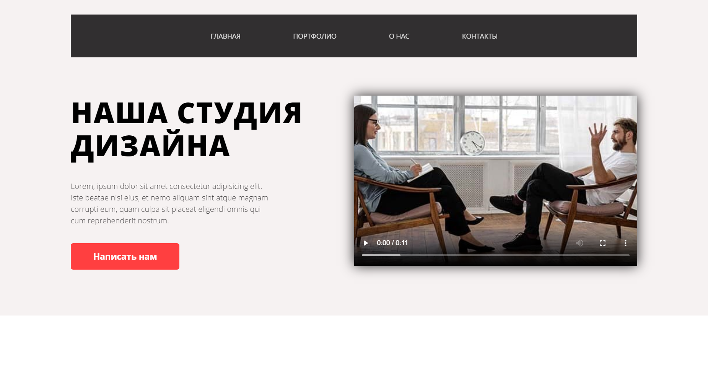
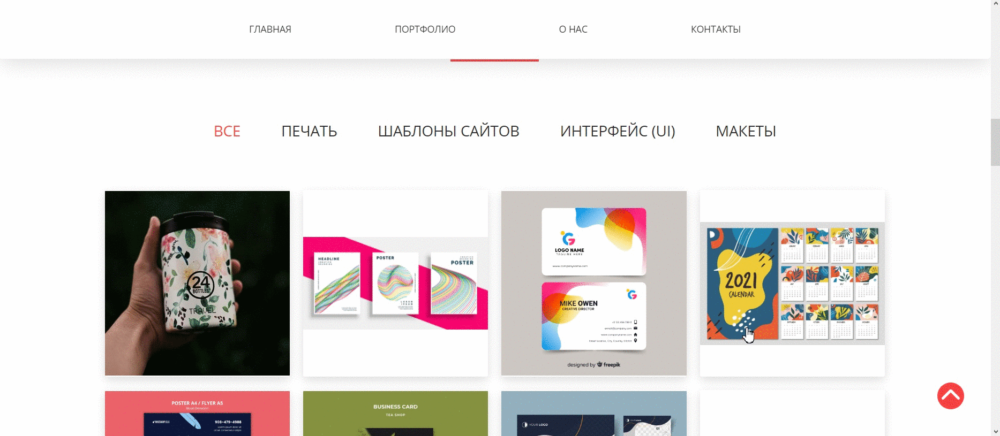
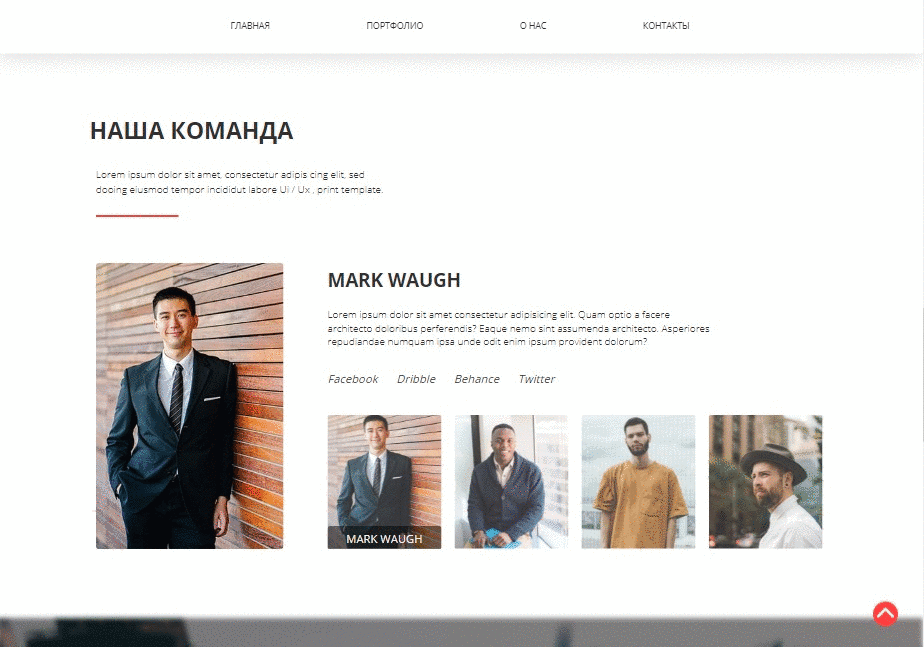
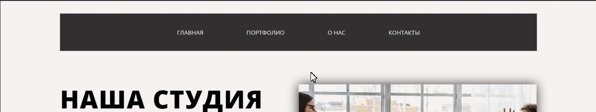
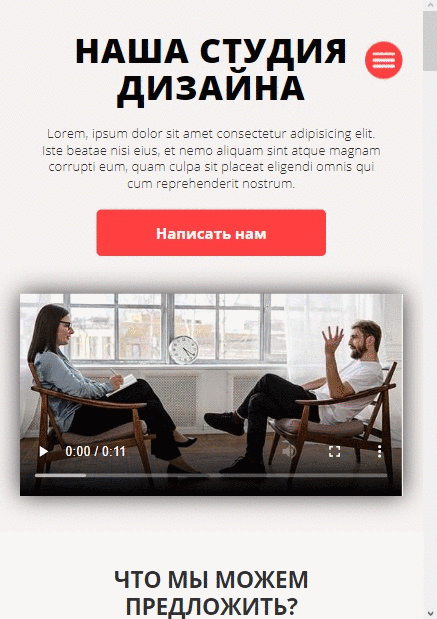

# Adaptive web-design landing page with JS elements and css animations
A website test project based on photoshop [layout](#layout) with adaptive design to all device sizes.

## Contents

- [Experience](#experience)
- [Demo](#demo)
- [How to Use](#how-to-use)
  - [Running locally](#running-locally)
  - [Development and testing](#development-and-testing)
- [Features and structure](#features-and-structure)
  - [Optimization](#optimization)
  - [Code flexibility and speed-up](#code-flexibility-and-speed-up)
  - [Adaptive design](#adaptive-design)
  - [Self written solutions](#self-written-solutions)
- [Layout](#layout)

<h2 id="experience">Experience	🎓</h2>

In  this  project i practice: 
- **BEM** Methodology;
- writing in **SCSS** syntax (**pseudoclasses, pseudoelements, mixins and variables**);
- Using and configuring **GULP** task runner;
- Creating an **adaptive** design without grid and mobile layout;
- Writing JS solutions using **JQuery**;
- Using css animations
- Using code minification and opimization GULP plugins.

<h2 id="demo">Demo 🎥</h2>

The completed project can be viewed [here](https://gnobious.github.io/Agnecy-landing/ "demo url")

<h2 id="how-to-use">How to Use 🔧</h2>
The setup required can be broken into two types:

1. If you wish to run project locally as is 
2. If you want to see or make edits to the source code

<h3 id="running-locally"> 1. Running a project locally</h3>

If you wish to run project locally as is, then all that's required is the `build` folder from this repository. Then just need  to open `index.html`.

<h3 id="development-and-testing"> 2. Making changes to the source code and testing</h3>

These instructions will get you a copy of the project up and running on your local machine for development and testing purposes.
#### *Prerequisites* 📋
You'll need [Git](https://git-scm.com) and [Node.js](https://nodejs.org/en/download/) (which comes with [NPM](http://npmjs.com)) installed on your computer.
Also, you can use [Yarn](https://yarnpkg.com/) instead of NPM ☝️
#### *Running* 🚀
From your command line, first clone RunSmart:

```bash
# Clone this repository
$ git clone https://github.com/gnobious/Agnecy-landing.git

# Go into the repository
$ cd Agnecy-landing

# Remove current origin repository
$ git remote remove origin
```

Then you can install the dependencies either using NPM or Yarn:

Using NPM:

```bash
# Install dependencies
$ npm install

# Start development server
$ npm start
```

Using Yarn:

```bash
# Install dependencies
$ yarn

# Start development server
$ yarn start
```

**NOTE**:
If your run into issues installing the dependencies with NPM, use this command:

```bash
# Install dependencies with all permissions
$ sudo npm install --unsafe-perm=true --allow-root
```

Once your server has started, go to this url `http://localhost:3000/` and you will see the website running on a Development Server:

<h3 align="center">
  
</h3>

<h2 id="features-and-structure">Features and structure 📓</h2>
All source components are in the `src` folder. All files in `build` was generated by gulp plugins used to optimize the project.
<h3 id="optimization">Optimization 📈</h3>

- Using **GULP** plugins for code and files minification and opimization :

  ```js
  // package.json
  "gulp-autoprefixer": "^7.0.1",
  "gulp-clean-css": "^4.3.0",
  "gulp-htmlmin": "^5.0.1",
  "gulp-imagemin": "^7.1.0",
  "gulp-purgecss": "^4.0.3",
  "gulp-sass": "^5.0.0",
  "gulp-shorthand": "^1.1.0",
  "gulp-terser": "^2.0.1",
  "gulp-sourcemaps": "^3.0.0",
  ```

- `src/styles/libs/_normalize.scss`
  makes browsers render all elements more consistently and in line with modern standards.
- `build/style.min.css`
  The resulting style file `style.min.css`, is also minified by the plugins for optimization purposes.
- `build/scripts/main.min.js`, `build/index.html`
  `index.html` and resulting scripts file `main.min.js` also was minified by the plugins.
- Minified **Jquery** files were used:
  
  ```html
  <!-- Jquery -->
  <script src="https://code.jquery.com/jquery-3.6.0.min.js">
  </script>
  ```

<h3 id="code-flexibility-and-speed-up">Code flexibility and work speed-up ⚡️</h3>

- The use of the CSS preprocessor, in particular SCSS, made it possible to speed up the layout and reduce the repeatability of the code.

	```bash
	├──src
		└── styles
			├── base
			|	├── _media.scss
			|	└── _variables.scss
			├── blocks
			|	├── _buttons.scss
			|	├── _contact.scss
			|	├── _elements.scss
			|	├── _footer.scss
			|	├── _header.scss
			|	├── _products.scss
			|	├── _services.scss
			|	├── _subscribe.scss
			|	└── _team.scss
			├── libs
			|	└── _normalize.scss
			└── style.scss
  ```

- Using the **GULP** task manager simplifies and speeds up the layout process. In particular, the plugins `gulp-sass`, `gulp-browsersync` are used for this project

<h3 id="adaptive-design">Adaptive design 📐</h3>

In this project, it was decided NOT to use ***bootstrap grid***. All adaptations are implemented using **Media Queries** and flex	


<h3 id="self-written-solutions">Self written solutions ✨</h3>

- Jquery tabs script

  

  ```js
  // Jquery Script for "Products" section Tabs 
   $('.products__menu__link').click(function() {     
        const curProdId = this.id;
        const curProdCategory = $('.products__block #' + curProdId);

        $('.products__block__item').not(curProdCategory).hide(0);
        curProdCategory.show(0);

        $('.products__menu__link').not($('#' + curProdId)).removeClass('products__menu__link_active');

        $(this).addClass('products__menu__link_active');
    });

    $('#products__all').click(function() {
        $('.products__block__item').show();
    });
  ```

- Jquery script for toggling team member info slide
  
  

  ```js
  // Jquery Toggle Slide script
  $('.team__photos__item').click(function() {
        const curItemId = this.id;
        const curPhotoBig = $('.team__photo__big #' + curItemId);
        const curTeamMember = $('.team__list #' + curItemId);
        
        $('.team__photos__label').removeClass('active');
        $(this).children('p').addClass('active');

        $('.team__photo__big__img').not(curPhotoBig).removeClass('team__member_active');
        curPhotoBig.addClass('team__member_active');

        $('.team__member').not(curTeamMember).removeClass('team__member_active');
        curTeamMember.addClass('team__member_active');
    });
    ```

- Sticking the Menu when scrolling

  
  
  ```js
  $(window).scroll(function() {
        if ($(this).scrollTop() > 30 && $nav.hasClass('main__nav')) {
            $nav.addClass('main__nav_scroll');            
        } else if ($(this).scrollTop() <= 30 && $nav.hasClass('main__nav_scroll')){
            $nav.removeClass('main__nav_scroll');            
        }
  });
  ```

- Mobile menu script (hamburger)

  

  ```js
  const $nav = $('.nav'),
  $menu = $('.main__nav'),
  $menuItem = $('.menu__item'),
  $hamburger = $('.hamburger');

  //  Mobile menu behavior
  $hamburger.click(function() {
      $hamburger.toggleClass('hamburger_active');
      $menu.fadeToggle();  // toggleClass('active')
  });

  $menuItem.click(function() {
      $hamburger.toggleClass('hamburger_active');
      $menu.fadeToggle();  //toggleClass('active')
  });
  ```

- Smooth page scroll and Page-up animation script

  ```js
  // Smooth scroll and Page Up button
  $(window).scroll(function(){
      if ($(this).scrollTop() > 600){
          $('.pageup').fadeIn();
      } else {
          $('.pageup').fadeOut();
      }
  });

  // Add smooth scrolling to all links
  $('a').on('click', function (e) {
      // Make sure this.hash has a value before overriding default behavior
      if (this.hash !== "") {
          e.preventDefault();
          const hash = this.hash;
          // Using jQuery's animate() method to add smooth page scroll
          // The optional number (500) specifies the number of milliseconds it takes to scroll to the specified area
          $('html, body').animate({
              scrollTop: $(hash).offset().top
          }, 500, function () {
              // Add hash (#) to URL when done scrolling (default click behavior)
              window.location.hash = hash;
          });
      }
  });
  ```

<h2 id="layout">Layout ✒️</h2>

The site layout is shown below.
The layout in another formats is also available in the [repository](https://github.com/gnobious/Agnecy-landing/tree/master/src/references/layouts/ "layouts source").

